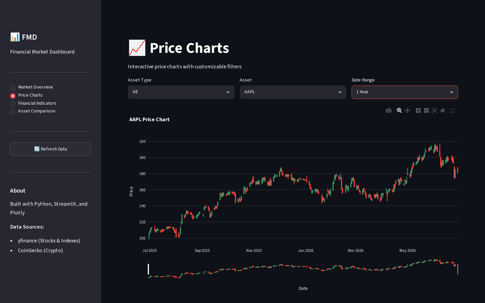
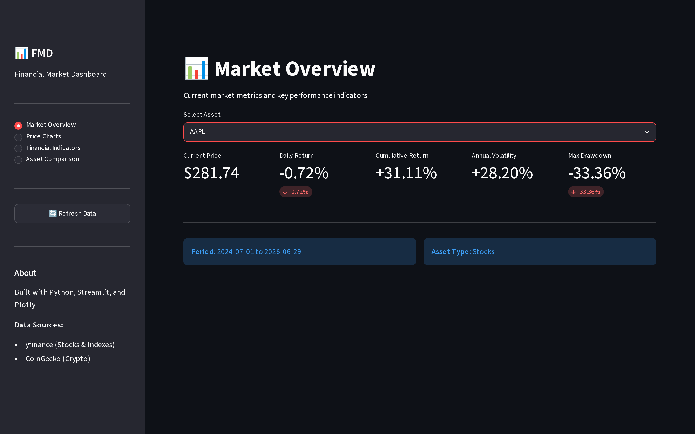
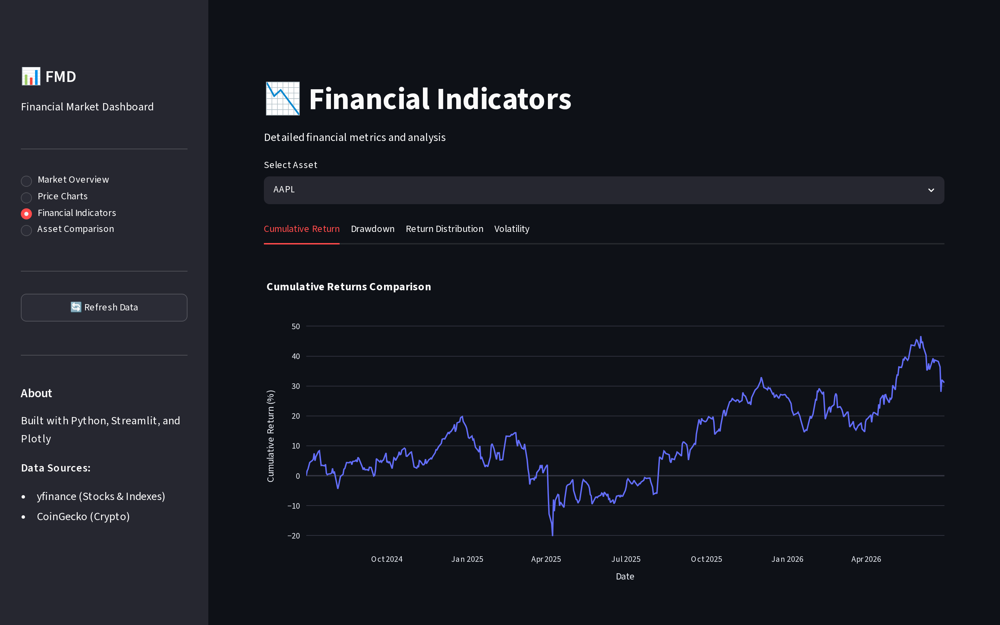
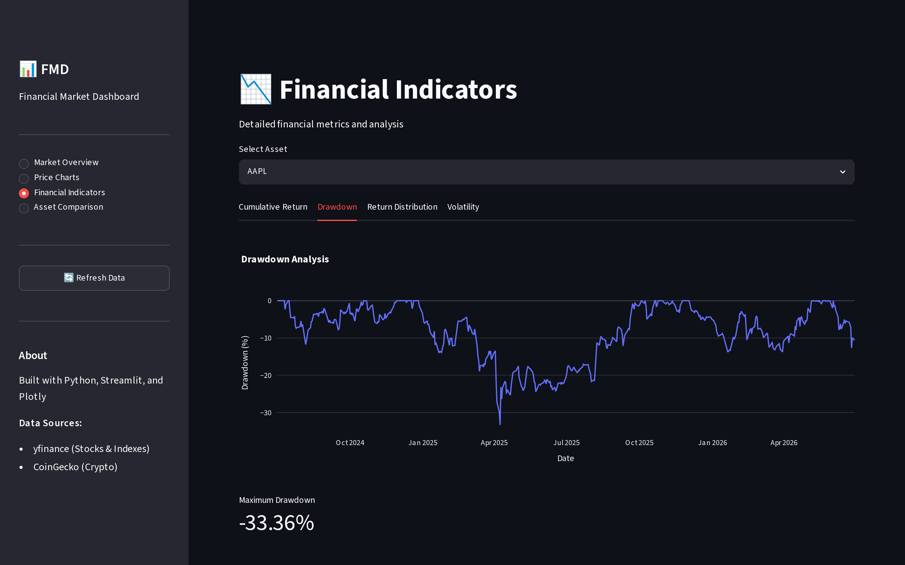
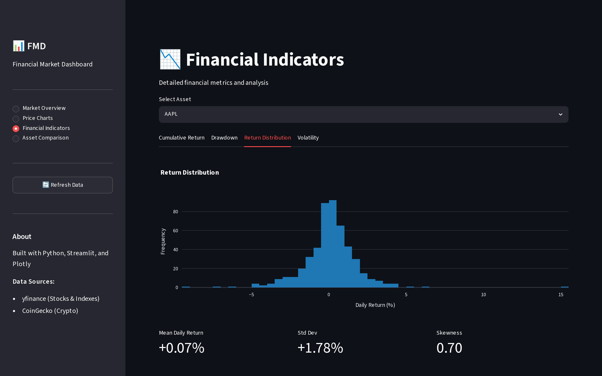
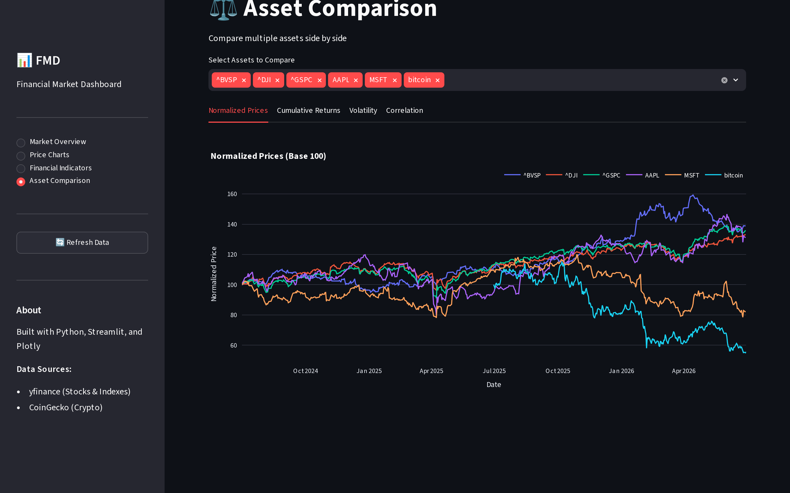
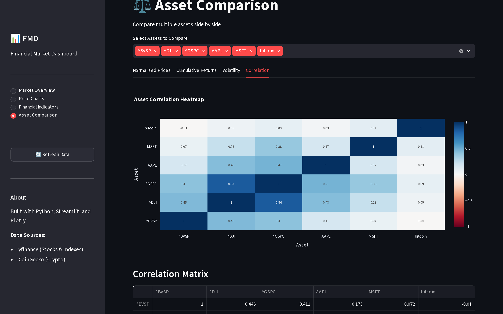

# Financial Market Dashboard

[](https://www.python.org/downloads/)
[](https://opensource.org/licenses/MIT)
[](https://github.com/fsoaz/financial-market-dashboard/actions/workflows/ci.yml)

A Streamlit web application for retrieving, analyzing, and visualizing financial market data from yfinance (stocks and indexes) and CoinGecko (cryptocurrencies). Data is stored as CSV files — on local disk by default, or in a private S3 bucket when deployed — and served through interactive Plotly charts.


## Features

- Multi-asset support: stocks, market indexes, and cryptocurrencies
- Financial indicators: daily/cumulative returns, volatility, drawdown
- Interactive Plotly charts with zoom and pan
- Asset comparison with normalized prices and correlation heatmap
- Optional technical indicators: SMA, EMA, RSI, MACD, Bollinger Bands

### Dashboard pages

| Page | Description | Preview |
|------|-------------|---------|
| **Price Charts** | Interactive candlestick and line charts with date range selectors and range slider | [View](docs/assets/price_charts.png) |
| **Market Overview** | Real-time KPI cards for price, daily/cumulative returns, volatility, and max drawdown | [View](docs/assets/market_overview.png) |
| **Financial Indicators** | Deep-dive analytics with cumulative returns, drawdown curves, and return distributions | [View](docs/assets/financial_indicators.png) |
| **Asset Comparison** | Side-by-side benchmarking with normalized prices (Base 100) and correlation heatmaps | [View](docs/assets/asset_comparison.png) |

<details>
<summary><b>📸 Click to expand screenshots of each dashboard view</b></summary>
<br>

#### 1. Price Charts (Candlestick & Line)


#### 2. Market Overview (KPI Cards)


#### 3. Financial Indicators (Cumulative Return, Drawdown & Return Distribution)




#### 4. Asset Comparison & Correlation Heatmap



</details>

## Prerequisites

- Python 3.12 or higher
- pip
- Network access to Yahoo Finance and CoinGecko
- Docker, only for [Running with Docker](#running-with-docker)

## Installation

```bash
git clone https://github.com/fsoaz/financial-market-dashboard.git
cd financial-market-dashboard

python -m venv venv
source venv/bin/activate   # Windows: venv\Scripts\activate

pip install -r requirements.txt
cp .env.example .env
```

> **Next:** Follow the [Getting started](docs/getting-started.md) tutorial to fetch data and open the dashboard in under 10 minutes.

## Running the application

Fetch market data first (required on first run if `data/` is empty):

```bash
python main.py
```

Start the dashboard:

```bash
streamlit run src/dashboard.py
```

Open `http://localhost:8501` in your browser.

For scheduled updates, see [Schedule data updates](docs/how-to/schedule-data-updates.md). To change default assets, see [Add assets](docs/how-to/add-assets.md).

## Running with Docker

The image ships the application only. `data/` is excluded by `.dockerignore`, and
`docker-entrypoint.sh` starts Streamlit without fetching data, so the container needs a
data source. Fetch into a host directory, then mount it:

```bash
docker build -t financial-market-dashboard .

# Fetch market data into ./data (repeat whenever you want fresher data)
docker run --rm -v "$(pwd)/data:/app/data" \
  --entrypoint python financial-market-dashboard main.py

docker run -p 8501:8501 -v "$(pwd)/data:/app/data" financial-market-dashboard
```

Open `http://localhost:8501`.

Without the mount the dashboard starts with empty dropdowns. See
[Troubleshooting](docs/how-to/troubleshooting.md#1-dashboard-shows-no-assets).

The container runs as UID 1000 (`Dockerfile`). If your host user has a different UID, make
`data/` writable by UID 1000 before the fetch step, or run `python main.py` on the host
instead.

The container can also read from S3 instead of a mounted directory by setting
`DATA_BACKEND=s3` and `S3_BUCKET`, provided it has AWS credentials. That is how the
deployed stack runs it — the EC2 instance role supplies the credentials. See
[Configuration](docs/reference/configuration.md#storage-backend) and
[Deploy to AWS](docs/how-to/deploy-to-aws.md).

## Project structure

```
financial-market-dashboard/
├── .github/
│   └── workflows/           # CI, image publish, data update, Terraform
├── data/
│   ├── raw/                 # Downloaded OHLCV data
│   └── processed/           # Data with financial indicators
├── docs/
│   ├── assets/              # Dashboard preview and screenshots
│   ├── getting-started.md
│   ├── how-to/
│   ├── reference/
│   └── explanation/
├── infra/
│   └── terraform/           # AWS infrastructure and GitHub OIDC role
├── scripts/
│   └── quality_gate.py      # CI coverage and AI quality gate
├── src/
│   ├── api.py               # yfinance and CoinGecko clients
│   ├── indicators.py        # Financial and technical indicators
│   ├── dashboard.py         # Streamlit UI
│   ├── utils.py             # CSV I/O and helpers
│   └── config.py            # Paths and environment settings
├── tests/
├── main.py                  # Data update entry point
├── Dockerfile
├── docker-entrypoint.sh
├── .dockerignore
├── requirements.txt
├── requirements-dev.txt
├── .env.example
├── CONTRIBUTING.md
├── CHANGELOG.md
└── README.md
```

## Documentation

| Guide | Description |
|-------|-------------|
| [Getting started](docs/getting-started.md) | Zero to working dashboard |
| [Add assets](docs/how-to/add-assets.md) | Configure stocks, indexes, and crypto |
| [Schedule data updates](docs/how-to/schedule-data-updates.md) | Cron and Task Scheduler |
| [Deploy to AWS](docs/how-to/deploy-to-aws.md) | Authenticate safely and run Terraform |
| [Troubleshooting](docs/how-to/troubleshooting.md) | Common failure modes |
| [Configuration](docs/reference/configuration.md) | Environment variables |
| [CI and quality gate](docs/reference/ci-cd.md) | Workflows, secrets, coverage threshold |
| [Python API](docs/reference/python-api.md) | Module and function reference |
| [Architecture](docs/explanation/architecture.md) | Data flow and design choices |

All pages are indexed in [docs/README.md](docs/README.md).

## Technologies

| Category | Technology |
|----------|------------|
| Language | Python 3.12+ |
| UI | Streamlit, Plotly |
| Data | Pandas, NumPy |
| APIs | yfinance, Requests (CoinGecko) |
| Config | python-dotenv |
| Testing | pytest |
| Linting | ruff |
| DevOps | Docker, GitHub Actions, Terraform, AWS |

## Running tests

```bash
pytest
pytest --cov=src --cov-report=html
pytest tests/test_indicators.py -v
```

## Contributing

See [CONTRIBUTING.md](CONTRIBUTING.md) for branch naming, tests, and the docs-with-code rule.

## Roadmap

- Portfolio performance analysis
- Alert system for price thresholds
- Export to Excel/PDF
- User authentication
- Database integration
- Increase test coverage for `dashboard.py` and `config.py`

## Disclaimer

This application is for educational and informational purposes only. It is not financial advice. Always do your own research before making investment decisions.

Data accuracy depends on third-party APIs (yfinance, CoinGecko). Delays or inaccuracies can occur.

## License

MIT — see [LICENSE](LICENSE).

## Acknowledgments

- [yfinance](https://github.com/ranaroussi/yfinance) for stock and index data
- [CoinGecko](https://www.coingecko.com/api) for cryptocurrency data
- [Streamlit](https://streamlit.io/) for the dashboard framework
- [Plotly](https://plotly.com/) for interactive visualizations
