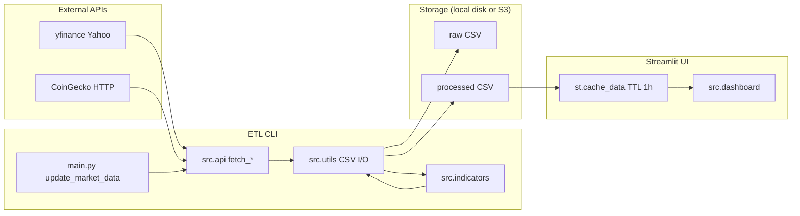
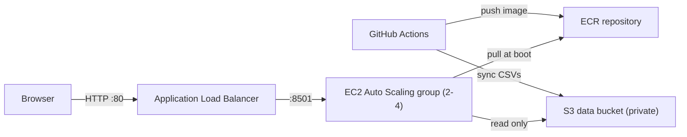

# Architecture

Why the app uses a CSV pipeline, how Streamlit serves charts, and where external APIs fit.

## Goals

- Keep the UI fast and offline-friendly after the first fetch
- Separate network I/O from interactive analysis
- Use simple, inspectable storage (CSV) suitable for education and local demos

There is no application database and no first-party HTTP API. Streamlit is the only process that serves the UI.

## Data flow

1. **`python main.py`** calls `update_market_data`.
2. **`src.api`** pulls equities/indexes via yfinance and crypto via CoinGecko.
3. **`src.utils.clean_data`** normalizes rows; raw frames are saved under `data/raw/`.
4. **`add_financial_indicators`** adds returns and drawdown; processed frames go to `data/processed/`.
5. **`streamlit run src/dashboard.py`** loads processed CSVs through `load_all_data(processed=True)`, caches them for one hour, and routes sidebar pages to render functions.

Steps 3–5 go through `src/utils.py`, which resolves `DATA_BACKEND` on every call. The
pipeline is identical for both backends; only the location of the CSVs changes.

The UI does not call yfinance or CoinGecko on each page view. Refresh market data with the CLI (or a scheduled job), then click **Refresh Data** in the sidebar.

## Why CSV instead of a database

- Transparent: open any file in a spreadsheet or `pandas.read_csv`
- Zero ops: no Postgres/Mongo to install for local use
- Fits the roadmap stage: database integration remains a future option

Trade-off: concurrent writers, large history, and multi-user hosting are out of scope for the current design.

## Storage backends

`Config.DATA_BACKEND` selects where `src/utils.py` reads and writes. The S3 layout mirrors
the local directory layout key for key, so the same CSVs work in either place.

| | `local` (default) | `s3` |
|---|---|---|
| Location | `data/raw/`, `data/processed/` | `s3://$S3_BUCKET/$S3_PREFIX/{raw,processed}/` |
| Written by | `python main.py` on the same machine | the `data-update` workflow, which fetches locally and syncs |
| Read by | the Streamlit process | the Streamlit container, via the EC2 instance role |
| Credentials | none | default boto3 chain |

`load_all_data` lists the folder prefix and paginates, because a single
`list_objects_v2` response stops at 1000 keys. Both details exist because getting them
wrong returns an empty dashboard rather than an error — see
[Configuration](../reference/configuration.md#storage-backend).

## Deployed topology

Boundaries worth knowing:

- The load balancer listens on **plain HTTP, port 80**, open to `0.0.0.0/0`. There is no
  TLS listener and no authentication in front of the dashboard.
- Instances accept traffic on 8501 only from the load balancer's security group.
- The instance role grants `s3:GetObject` and `s3:ListBucket` on the data bucket and image
  pulls from ECR. The application running there cannot write market data.
- Writes to the bucket come from GitHub Actions through an OIDC-assumed role, not from the
  application.

All of this is defined in `infra/terraform/`. See
[Deploy to AWS](../how-to/deploy-to-aws.md).

## Caching

| Layer | Mechanism | Behavior |
|-------|-----------|----------|
| Streamlit | `@st.cache_data(ttl=3600)` | In-process; cleared by **Refresh Data** or process restart |
| Config | `CACHE_EXPIRY_HOURS` | Read into `Config` but not wired to the dashboard TTL yet |

See [Configuration](../reference/configuration.md).

## Module responsibilities

| Module | Responsibility |
|--------|----------------|
| `main.py` | Orchestrate fetch → clean → indicators → save |
| `src/api.py` | External HTTP/Yahoo access and `DataFetchError` |
| `src/indicators.py` | Returns, volatility, drawdown, optional technicals |
| `src/utils.py` | Logging, cleaning, backend-aware CSV I/O, correlation, formatting |
| `src/config.py` | Env-backed settings and directory layout |
| `src/dashboard.py` | Streamlit pages and Plotly charts |

## Asset typing

- Tickers starting with `^` are labeled `indexes` when fetched as stocks/indexes.
- CoinGecko IDs are labeled `crypto`.
- Everything else from yfinance equity fetches is labeled `stocks`.

## Related

- [Deploy to AWS](../how-to/deploy-to-aws.md)
- [CI and quality gate](../reference/ci-cd.md)
- [Getting started](../getting-started.md)
- [Schedule data updates](../how-to/schedule-data-updates.md)
- [Python API](../reference/python-api.md)
